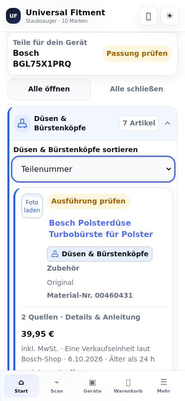
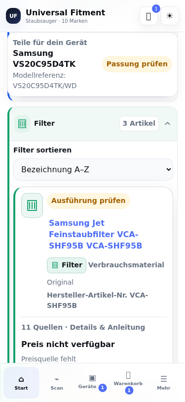

# Mobile Gerätesicht · Issue #15

Reviewbares UI-Paket für `work/ui-vacuum-detail-next`, auf Basis von
`6545d9affb6b3c6c04b8d585084f2094a09e77b1` / v1.27.1. Der App-Quellcode bleibt
im bestehenden Checkpoint-Format. `changes.patch` enthält die eigentliche
Änderung; `manifest.json` prüft Ausgangs- und Ergebnisdateien bytegenau.

## UX-Bestandsaufnahme

| Bereich | Bereits vorhanden | Verbesserung |
| --- | --- | --- |
| Gerätesicht | Modell, kopierbare Kennungen, Gerätepass und Support | Teile direkt unter dem Gerät; Modell/Ländercode und „Passung prüfen“ bleiben beim Scrollen sichtbar. EAN/Barcodes bleiben aufklappbar und kopierbar. |
| Kategorien | Ein gemeinsamer nativer `details`-/`summary`-Baum mit Farben, Symbolen, Artikelanzahl und „Alle öffnen/schließen“ | Lesbare Überschriften, mindestens 44 px große Bedienelemente, sichtbare/gesamte Kategorieanzahl bei Filtern, eigene Sortierung je Kategorie. Kein zweiter Kategorienbaum. |
| Filter | Suche, Original/Nachbau, Artikelart und Bauteil | Zuordnungsstatus, vergleichbarer/unbekannter EUR-Preis, Preis von/bis mit deutschem Dezimalkomma, inklusive Grenzen und verständliche Eingabefehler. Gemeinsames Zurücksetzen. |
| Sortierung | Bezeichnung, erfasster Preis in beide Richtungen und Einbauzeit | Natürliche Teilenummernsortierung und Suchrelevanz. Ein globaler Sortierwechsel setzt lokale Sortierüberschreibungen zurück; Öffnungszustände bleiben erhalten. |
| Preise | Vergleichbare DE-Brutto-EUR-Quellenpreise wurden bereits sortiert; nicht vergleichbare Werte zuletzt | Fehlende Preise heißen ausdrücklich „Preis nicht verfügbar“. Unbekannte, fremdwährungs-, Netto- und Staffelpreise bleiben in beiden Preisrichtungen zuletzt und werden bei Preisgrenzen ausgeblendet. Alte Quellenpreise werden dadurch nicht zu Live-Angeboten. |
| Leere/Ladezustände | Fehlender Markenabruf mit Retry; generischer leerer Teilebereich | „Noch nicht geladen“, „Teileliste noch nicht erfasst“ und „Keine Artikel für diese Filter“ sind unterscheidbar. Auch beim Laden/Fehler bleiben Modell- und Ländercodes sichtbar. |
| Tastatur | Native Kategorien und als Button markierte Artikelkarten | Native Artikel-Buttons ohne verschachtelte Button-Rollen, separater Fotoabruf, Enter/Leertaste für Kategorien, Fokus nach lokaler Sortierung und Filter-Reset, beschriftete Felder und Live-Ergebnisanzahl. |

Eine Modell- oder Serienzuordnung bestätigt keine konkrete Passung. Weitere
Serienteile bleiben separat als ungeprüfte Ausführungen sichtbar und zählen
nicht als gefilterte, zugeordnete Artikel. Die Filter ändern ausschließlich die
Ansicht der vorhandenen Modellliste.

Beim echten Browsertest war der bestehende Retry nach einem fehlgeschlagenen
`import()` wirkungslos: Browser merken sich einen fehlgeschlagenen Modulabruf.
Der Retry lädt deshalb die aktuelle Route neu. Die kanonischen Paket-URLs und
der bestehende Offline-Cache bleiben erhalten; gespeicherte Geräte und
Warenkorb bleiben lokal gespeichert. Flüchtige Filter- und Öffnungszustände
werden bei diesem Neuladen zurückgesetzt.

## Anwenden und prüfen

Aus dem Repository-Hauptverzeichnis, auf dem Arbeitsbranch:

```bash
python3 integrations/restore-source-checkpoint.py --target site
python3 integrations/ui-vacuum-detail-next/apply.py --target site
npm ci --prefix integrations/auth-sdk --ignore-scripts
node integrations/build-app.mjs
node integrations/build-app.mjs --check
npm test --prefix site
npm run check --prefix site
PYTHONDONTWRITEBYTECODE=1 python3 integrations/ui-vacuum-detail-next/apply.test.py
```

Ein bereits angewendeter Patch ist ein unveränderter No-op. Bei abweichenden
UI-Ausgangsdateien verweigert das Skript die Anwendung, bevor es Dateien
schreibt. Alle Ausgaben werden zuerst in einem temporären Verzeichnis
gepatcht und geprüft. Die Projektleitung muss Änderungen anderer Branches
gezielt zusammenführen, bevor sie dieses Paket in eine spätere Releasekette
übernimmt.

Das Paket betrifft nur diese fünf App-Dateien:

| Datei | Zweck |
| --- | --- |
| `src/app.js` | Bestehende Gerätesicht, Kategorien und Ereignisse erweitern |
| `styles.css` | Mobile Lesbarkeit, Fokus, Umbrüche und Modellkontext |
| `src/core/model-parts-view.js` | Unveränderliche Filter-/Sortierlogik und leere Zustände |
| `tests/model-parts-view.test.mjs` | Preisgrenzen, unbekannte Preise, Suchrelevanz, Status und acht Markenpakete |
| `package.json` | Neue Testgruppe und Syntaxprüfung; Version bleibt 1.27.1 |

`src/data/`, Preis-/Angebotsdaten, Artikelidentitäten, `sw.js`, `index.html`,
Manifest, Backup-/Warenkorbmodule und `.github/workflows/pages.yml` wurden
nicht geändert. Kompilierte App-/Markenpakete gehören nicht zu diesem PR.
Der PR aktiviert keine Release- oder Deployment-Schritte.

## Browserprüfung

`browser.test.mjs` startet einen eigenen lokalen HTTP-Server und prüft die
gebaute App mit Playwright/Chromium. Playwright muss in der QA-Umgebung
vorhanden sein; es wird keine App-Abhängigkeit hinzugefügt.

```bash
node integrations/ui-vacuum-detail-next/browser.test.mjs
```

Bei einer separat installierten QA-Laufzeit können
`UF_PLAYWRIGHT_MODULE=/pfad/zu/playwright/index.mjs` und
`UF_CHROMIUM_EXECUTABLE=/pfad/zu/chromium` angegeben werden. Ein abweichendes
wiederhergestelltes App-Verzeichnis kann als erstes Argument übergeben werden.
Alle externen Foto-, Auth- und Marktplatzanfragen sind während des Tests
gesperrt.

Ergebnis und Grenzen: [validation.md](validation.md). Screenshots:

| Zustand bei 375 × 812 px | Screenshot |
| --- | --- |
| Bosch BGL75X1PRQ, aufgeklappte Kategorie, Teilenummernsortierung | [Bosch](screenshots/bosch-375-category.png) |
| Samsung VS20C95D4TK/WD, geladene Filter ohne Preis | [Samsung ohne Preis](screenshots/samsung-375-unknown-price.png) |
| Samsung VCC8460H3B/XEG, noch fehlende Modellteileliste | [Fehlende Liste](screenshots/samsung-375-missing-list.png) |
| Hoover HF202P 011 / 39401035, Markenabruf fehlgeschlagen | [Ungeladene Marke](screenshots/hoover-375-unloaded.png) |
| Bosch, 200 % Textgröße | [Textvergrößerung](screenshots/bosch-375-text-200.png) |
| Samsung, dunkle Darstellung | [Dunkle Darstellung](screenshots/samsung-375-dark.png) |




